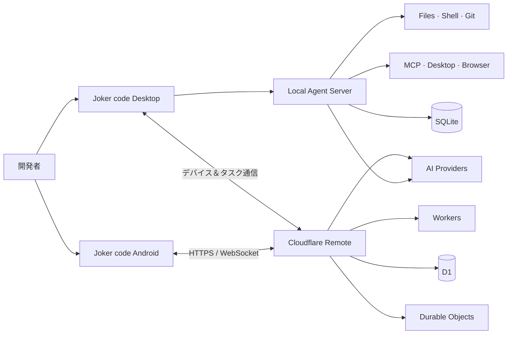

<div align="center">

# ⌁ Joker code

### ローカル優先・権限制御可能な AI コーディングエージェント

明確なワークスペース境界と承認ポリシーのもとで、AI がコード理解、ファイル編集、テスト・ビルド、Git ワークフロー、デスクトップ操作、クロスデバイス協調を実行できるようにします。

<p align="center">
  <a href="README.md"><b>English</b></a> •
  <a href="README.zh-CN.md"><b>简体中文</b></a> •
  <a href="README.zh-TW.md"><b>繁體中文</b></a> •
  <a href="README.ja.md"><b>日本語</b></a>
</p>

[](#-実行環境)
[](#-実行環境)
[](#-クイックスタート)
[](#-技術スタック)

`ローカル実行` · `段階的承認` · `マルチモデル対応` · `画像生成` · `モバイル遠隔操作` · `MCP 拡張`

</div>

---

## ✦ プロジェクト概要

Joker code は、実際の開発現場を想定したローカルファーストの AI エージェントフレームワークです。デスクトップクライアントを介して OpenAI 互換モデルに接続し、プロジェクトのワークスペース内でファイル操作、ターミナル、Git、ブラウザ、デスクトップ自動化ツールを呼び出し、`allow / ask / deny` のきめ細やかな権限ルールで安全に操作範囲を制御します。

本プロジェクトには Android クライアントと Cloudflare ベースのリモートサービスも含まれています。PC がオンラインのときはスマートフォンから公開プロジェクトやセッションに参加してエージェントタスクを継続でき、PC がオフラインのときは Work モードによりクラウド経由でチャットや画像生成を行うことができます。

> [!IMPORTANT]
> Joker code はパス検証、コマンド解析、ツール承認、監査ログによって実用的なセキュリティ境界を提供しますが、OS レベルの完全なサンドボックスを提供するものではありません。本番環境、機密データ、高権限コマンドを扱う際は、コンテナ、専用アカウント、または分離された環境をご利用ください。

## ◈ コア機能

| モジュール | 機能詳細 |
| --- | --- |
| 🤖 **エージェントワークフロー** | SSE による準備、計画、検証、実行、承認、完了フェーズのリアルタイム配信。計画のみを確認した後の実行にも対応 |
| 🧰 **ローカルツール** | ファイル読み書き、テキスト検索、パッチ適用、テスト・ビルド、常駐プロセス管理、Web ページ取得、Git 操作、プロジェクト診断 |
| 🛡️ **権限システム** | `allow / ask / deny` ルール、ワークスペース境界、強制承認ポリシー、機密パス保護、完全な監査ログ |
| 🧠 **コンテキスト管理** | `AGENTS.md`、プロジェクトルール、Skills、メモリの読み込み。ツール呼び出しチェーンを完全維持した長文セッションの自動要約・圧縮 |
| 🔌 **モデル & MCP** | 複数の OpenAI 互換エンドポイント、モデル自動検出、思考深度（Thinking intensity）切り替え、MCP ツールの動的連携 |
| 🎨 **画像生成** | デスクトップ＆モバイルの画像生成モード。画像モデル選択、プレビュー生成、ローカルファイル保存に対応 |
| 🖥️ **デスクトップ制御** | `native-devtools-mcp` を介した Accessibility API、スクリーンショット/OCR、Chrome/Electron CDP 連携によるデスクトップ自動化 |
| 📱 **クロスデバイス協調** | Android チャット、デバイス検出、プロジェクト/セッション選択、リモートタスク実行、リアルタイムイベント同期、単発承認 |
| ☁️ **リモートサービス** | Cloudflare Workers + D1 + Durable Objects による認証、暗号化 AI 設定管理、WebSocket リレー |
| ♻️ **自己学習機能** | 検証済みの結果から再利用可能な知見を蓄積し、重複を排除したログとして以後のプロジェクトコンテキストに注入 |

## ⌘ システム構成



## ▣ 実行環境

| ターゲット | 主要ディレクトリ | 開発 | ビルド / テスト |
| --- | --- | --- | --- |
| **デスクトップクライアント** | `src/`、`electron/`、`cli/` | `npm run desktop:dev` | `npm run desktop:build` |
| **ローカル Agent サーバー** | `server/` | `npm run server:dev` | `npm run server:test` |
| **Android クライアント** | `Joker_apk/` | `npm run mobile:dev` | `npm run mobile:build` / `npm run mobile:apk` |
| **クラウド認証 & リモート** | `Fwq/` | `npm run remote:dev` | `npm run remote:check` / `npm run remote:test` |

## ▶ クイックスタート

### 前提要件

- Node.js 20+
- npm
- macOS デスクトップクライアント開発環境
- Android Studio（Android APK のビルド時のみ必要）

### デスクトップ開発環境の起動

```bash
npm install
cp .env.example .env
npm run desktop:dev
```

Vite のデフォルト開発サーバーは `http://localhost:5173` で起動します。

### AI プロバイダーの設定

バックエンドは OpenAI 互換の Chat Completions および Images API に対応しています：

```env
AI_API_KEY=your_api_key
AI_BASE_URL=https://api.openai.com/v1
AI_MODEL=gpt-4.1-mini
```

アプリ内の「設定」画面から複数のエンドポイントを登録・管理し、モデルの検出、デフォルトのテキスト/画像モデルの選択、思考深度の設定を行うことも可能です。API キーはローカルの環境変数またはセキュアストレージにのみ保存し、Git リポジトリにはコミットしないでください。

### 主なテスト・検証コマンド

```bash
npm test                 # ローカル Agent サーバーのテスト実行
npm run build            # デスクトップ Web アセットのビルド
npm run mobile:build     # Android Web アセットのビルド
npm run remote:test      # Cloudflare リモートサービスのテスト実行
```

## 🧠 2層メモリ構造

**設定 → メモリ** から、2 つのコンテキスト層を個別に設定できます：

- **短期メモリ**：トークン予算内で直近の完全な対話履歴を保持し、過去のやり取りをローカル要約に圧縮してツール出力の肥大化を防止。
- **長期メモリ**：プロジェクトパスごとに分離してローカル SQLite に保存し、キーワード関連性・重要度・新しさに基づいて検索。有効期限（TTL）、重複排除、機密情報の除外に対応。

内蔵の `memory-management` Skill により標準的な連携インターフェースを提供します。他のオープンソースの Memory Skill も、Joker code のデータベース構造に直接依存することなく、`memory_search`、`memory_store`、`memory_forget` に永続化を委譲できます。「Skill 連携」を無効にすると、これらのツールはモデルに公開されません。

## ⚙ 常駐プロセスセッション

開発サーバーやファイル監視など、自動終了しないコマンドは Joker code が管理するため、`&` や `nohup` を付与する必要はありません：

- `start_process`：常駐プロセスを起動し、セッション ID、PID、初期出力を返却。
- `read_process`：現在のステータスと直近の出力ログを取得。
- `write_process`：プロセスの標準入力（stdin）にデータを送信。
- `stop_process`：プロセスおよびその子プロセスツリー全体を停止。
- `list_processes`：現在のアクティブプロジェクトで管理されているプロセス一覧を表示。

チャット入力欄横の「ターミナル」メニューから、プロセスの状態、PID、実行コマンド、出力を確認できます。管理中のプロセスは Joker code サーバー終了時に自動的に安全終了され、再起動時に古いコマンドが意図せず自動実行されることはありません。

## ◉ macOS デスクトップ制御

Joker code はローカルの `native-devtools-mcp` サービスと連携し、macOS アプリケーション画面の読み取りと操作を行えます：

```bash
npm install -g native-devtools-mcp@0.10.1
native-devtools-mcp setup
```

MCP 設定で実行ファイルの絶対パスを使用して stdio サービスを追加し、「システム設定 → プライバシーとセキュリティ」で必要な権限を許可します：

- **画面収録**：スクリーンショットと OCR に必要。
- **アクセシビリティ**：クリック、入力、スクロール、ドラッグ、UI 要素ツリー操作に必要。

画面を変更する操作は `ask` に設定することを推奨します。エージェントはマウスカーソルを動かさない Accessibility 操作を優先し、画面の変化を確認しながら操作を進めます。

## 🔐 権限とセキュリティ

Joker code は「ワークスペース境界 ＋ ツール承認 ＋ 監査ログ」の階層的防御戦略を採用しています：

- ワークスペース内の読み取り、編集、検索、テスト、ビルドはポリシーに従って自動実行可能。
- 依存関係のインストール、ネットワーク通信、マイグレーション、コンテナ変更は実行前に確認プロンプトを表示。
- Git コミット/プッシュ、デプロイ、クラウドインフラ変更は明示的な確認が必須。
- データ削除、本番環境への操作、権限昇格コマンドは都度承認が必要。
- `.env*`、SSH 秘密鍵、キーチェーン、ブラウザのプロファイルデータベースなどの機密パスはデフォルトでアクセス拒否。
- シークレットはツールの引数に直接渡さず、許可リストの参照によって注入され、出力内の実際の値は自動マスキングされます。

詳細なルールとセキュリティ境界は [機能と権限ベースライン (docs/capabilities-and-permissions.md)](docs/capabilities-and-permissions.md) を参照してください。

## ☁ アカウントとリモート協調

`Fwq/` は Cloudflare Workers を利用したリモートサービスを提供します：

- ユーザー登録、ログイン、セッション復元、ログアウト。
- Cloudflare D1 によるアカウント、セッション、デバイス、タスク、暗号化 AI 設定の保存。
- Durable Objects による同一アカウント内のリアルタイムデバイス接続の協調。
- 使い捨て WebSocket チケットとアカウント単位のルーム分離。
- Work モード：PC オフライン時のチャットおよび画像生成のプロキシ。
- Code モード：PC 側が明示的に公開したプロジェクト ID のみに限定アクセスし、スマートフォンから任意のローカルパスへのアクセスは拒否。

詳細な API 定義、デプロイ手順、セキュリティ設計については [`Fwq/README.md`](Fwq/README.md) を、Android の機能とビルド手順については [`Joker_apk/README.md`](Joker_apk/README.md) を参照してください。

## ⧉ 技術スタック

- **デスクトップ & Web：** Electron, React 19, Vite, TypeScript
- **ローカルサーバー：** Node.js, Express, SQLite
- **モバイルクライアント：** React, Capacitor, Android
- **クラウドリモート：** Cloudflare Workers, D1, Durable Objects
- **プロトコル & 拡張：** SSE, WebSocket, MCP, OpenAI 互換 API

## ◇ プロジェクト構成

```text
Joker/
├── src/                 # デスクトップ React UI
├── electron/            # Electron メインプロセス & セキュアストレージ
├── server/              # ローカル Agent・ツール・権限・状態管理サーバー
├── cli/                 # CLI エントリポイント
├── config/              # Agent & モデルプロバイダー設定
├── docs/                # 機能・権限・設計ドキュメント
├── Joker_apk/           # Android モバイルクライアント
└── Fwq/                 # Cloudflare 認証 & リモートサービス
```

---

<div align="center">

**Joker code · Code locally, approve explicitly, collaborate anywhere.**

</div>
