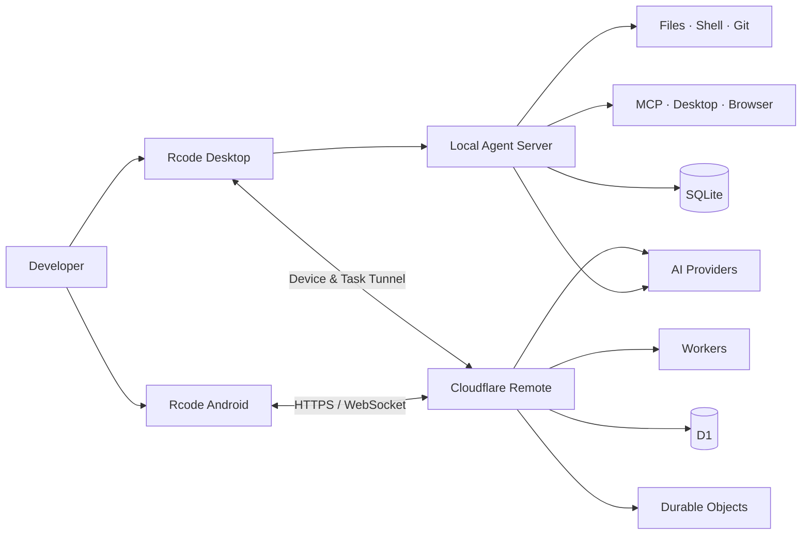

<div align="center">

# ⌁ Rcode

### Local-first, Permission-Controlled AI Coding Agent

Empowering AI to understand code, edit files, test & build, manage Git workflows, automate desktop tasks, and collaborate across devices—all within explicit workspace boundaries and approval policies.

<p align="center">
  <a href="README.md"><b>English</b></a> •
  <a href="README.zh-CN.md"><b>简体中文</b></a> •
  <a href="README.zh-TW.md"><b>繁體中文</b></a> •
  <a href="README.ja.md"><b>日本語</b></a>
</p>

[](#-run-targets)
[](#-run-targets)
[](#-quick-start)
[](#-tech-stack)

`Local Execution` · `Graduated Approvals` · `Multi-Model Access` · `Image Generation` · `Remote Mobile` · `MCP Extensibility`

</div>

---

## ✦ Introduction

Rcode is a local-first AI Agent framework designed for real-world software engineering workflows. Through its desktop client, it connects to any OpenAI-compatible model, invoking tools across files, terminal, Git, browser, and desktop automation within project workspaces, governed by granular `allow / ask / deny` permission rules.

The project also includes an Android mobile client and Cloudflare-backed remote services: when your computer is online, you can access public projects and sessions from your phone to continue running Agent tasks; when your computer is offline, Work mode allows chat interactions and image generation via cloud proxy.

> [!IMPORTANT]
> Rcode relies on path validation, command analysis, tool approvals, and audit logging to provide a portable security perimeter. It does not claim an OS-level sandbox. For production environments, sensitive data, or high-privilege commands, containers, dedicated user accounts, or isolated machines should still be used.

## ◈ Core Capabilities

| Module | Features & Capabilities |
| --- | --- |
| 🤖 **Agent Workflow** | SSE real-time streaming for preparation, planning, inspection, execution, approval, and completion phases; supports plan-first execution with user confirmation |
| 🧰 **Local Tools** | File I/O, text search, patching, test & build, long-running processes, web fetching, Git workflows, and project diagnostics |
| 🛡️ **Permission System** | `allow / ask / deny` rules, strict workspace boundaries, mandatory approval policies, sensitive path protection, and full audit logging |
| 🧠 **Context Management** | Loads `AGENTS.md`, project rules, Skills, and memories; automatically compresses long sessions while preserving complete tool-call chains |
| 🔌 **Models & MCP** | Multi-endpoint OpenAI-compatible support, model auto-discovery, thinking intensity adjustments, and dynamic MCP tool integration |
| 🎨 **Image Generation** | Desktop and mobile image generation modes; supports model selection, live previews, and direct local file saving |
| 🖥️ **Desktop Control** | Accessibility APIs, screenshot/OCR, and Chrome/Electron CDP automation powered by `native-devtools-mcp` |
| 📱 **Cross-Device Collaboration** | Android chat, local/remote device discovery, project/session switching, remote agent tasks, real-time event sync, and one-off approvals |
| ☁️ **Remote Services** | Cloudflare Workers + D1 + Durable Objects providing authentication, encrypted AI configurations, and WebSocket relays |
| ♻️ **Autonomous Learning** | Extracts reusable knowledge from verified task results and injects deduplicated insights into subsequent project contexts |

## ⌘ Architecture



## ▣ Run Targets

| Target | Main Directory | Development | Build / Verification |
| --- | --- | --- | --- |
| **Desktop Client** | `src/`, `electron/`, `cli/` | `npm run desktop:dev` | `npm run desktop:build` |
| **Local Agent Server** | `server/` | `npm run server:dev` | `npm run server:test` |
| **Android Client** | `Rcode_apk/` | `npm run mobile:dev` | `npm run mobile:build` / `npm run mobile:apk` |
| **Cloud Auth & Remote Services** | `Fwq/` | `npm run remote:dev` | `npm run remote:check` / `npm run remote:test` |

## ▶ Quick Start

### Prerequisites

- Node.js 20+
- npm
- macOS desktop client development environment
- Android Studio (required only for building the Android APK)

### Launch Desktop Development

```bash
npm install
cp .env.example .env
npm run desktop:dev
```

The default Vite development server runs at `http://localhost:5173`.

### Configure AI Providers

The backend is compatible with OpenAI-compatible Chat Completions and Images APIs:

```env
AI_API_KEY=your_api_key
AI_BASE_URL=https://api.openai.com/v1
AI_MODEL=gpt-4.1-mini
```

You can also manage multiple endpoints, discover models, choose default text/image models, and configure thinking intensities via the desktop Settings UI. API keys should only be stored locally in your environment or secure app configuration—never commit them to version control.

### Verification & Testing Commands

```bash
npm test                 # Run local Agent server tests
npm run build            # Build desktop Web assets
npm run mobile:build     # Build Android Web assets
npm run remote:test      # Run Cloudflare remote service tests
```

## 🧠 Two-Tier Memory

In **Settings → Memory**, you can configure two context tiers:

- **Short-term Memory**: Retains the most recent full dialogue turns within a token budget, compresses earlier turns into local summaries, and caps oversized tool outputs.
- **Long-term Memory**: Isolated by project path and persisted to local SQLite; recalled based on keyword relevance, importance, and recency. Supports TTL expiration, deduplication, and credential redaction.

The built-in `memory-management` Skill provides standard adaptation contracts. Other open-source Memory Skills can delegate persistence to `memory_search`, `memory_store`, and `memory_forget` without direct dependencies on Rcode's database schema. When "Skill Adaptation" is disabled, these three tools will not be exposed to models.

## ⚙ Long-Running Process Sessions

Commands that do not terminate on their own (e.g., dev servers, file watchers) are managed by Rcode without needing `&` or `nohup`:

- `start_process`: Starts a background process and returns its session ID, PID, and initial output.
- `read_process`: Reads current status and recent output logs.
- `write_process`: Sends input to the process standard input (stdin).
- `stop_process`: Stops the process and its entire child process tree.
- `list_processes`: Lists all managed processes for the active project.

Access the "Terminal" entry next to the chat input to inspect process status, PIDs, commands, and output logs. Managed processes are gracefully terminated when the Rcode server exits and are not automatically resumed upon restart.

## ◉ macOS Desktop Control

Rcode can connect to a local `native-devtools-mcp` service to inspect and interact with macOS application windows:

```bash
npm install -g native-devtools-mcp@0.10.1
native-devtools-mcp setup
```

Add the stdio service using the absolute executable path in MCP Settings, and grant the required permissions in **System Settings → Privacy & Security**:

- **Screen Recording**: Required for screenshots and OCR.
- **Accessibility**: Required for clicks, typing, scrolling, dragging, and UI element tree inspection.

It is recommended to set UI-modifying actions to `ask`. The Agent prioritizes Accessibility actions that do not move the physical cursor and observes UI changes after each operation.

## 🔐 Permissions & Security

Rcode adopts a tiered defense strategy: **Workspace Boundaries + Tool Approvals + Audit Logs**:

- In-workspace read, edit, search, test, and build tasks can execute automatically based on policy.
- Dependency installation, network requests, migrations, and container modifications prompt before execution.
- Git commits/pushes, deployments, and cloud infrastructure changes require explicit confirmation.
- Data deletion, production operations, and privilege escalation commands require one-off approvals.
- Sensitive targets like `.env*`, SSH private keys, keychains, and browser profile databases are denied by default.
- Secrets are injected via allowlist references instead of raw tool parameters; actual values in output streams are automatically masked.

For complete rules and security boundaries, refer to [Capabilities and Permissions Baseline](docs/capabilities-and-permissions.md).

## ☁ Cloud Accounts & Remote Collaboration

`Fwq/` provides the Cloudflare Workers remote service:

- User registration, login, session recovery, and logout.
- Cloudflare D1 stores accounts, sessions, devices, tasks, and encrypted AI provider configurations.
- Durable Objects coordinate real-time device connections under the same account.
- One-time WebSocket tickets and account-level room isolation.
- Work mode proxies chat and image generation when the host computer is offline.
- Code mode strictly accesses projects explicitly published by the host computer; it does not accept arbitrary arbitrary host paths from mobile clients.

For detailed API definitions, deployment guides, and security designs, see [`Fwq/README.md`](Fwq/README.md); for Android capabilities and build steps, see [`Rcode_apk/README.md`](Rcode_apk/README.md).

## ⧉ Tech Stack

- **Desktop & Web:** Electron, React 19, Vite, TypeScript
- **Local Server:** Node.js, Express, SQLite
- **Mobile Client:** React, Capacitor, Android
- **Cloud Remote:** Cloudflare Workers, D1, Durable Objects
- **Protocols & Integrations:** SSE, WebSocket, MCP, OpenAI-compatible APIs

## ◇ Project Structure

```text
Rcode/
├── src/                 # Desktop React UI
├── electron/            # Electron main process & secure storage
├── server/              # Local Agent, tools, permissions & state services
├── cli/                 # CLI entry point
├── config/              # Agent & model provider configuration
├── docs/                # Capabilities, permissions, and architectural docs
├── Rcode_apk/           # Android mobile client
└── Fwq/                 # Cloudflare authentication & remote services
```

---

<div align="center">

**Rcode · Code locally, approve explicitly, collaborate anywhere.**

</div>
