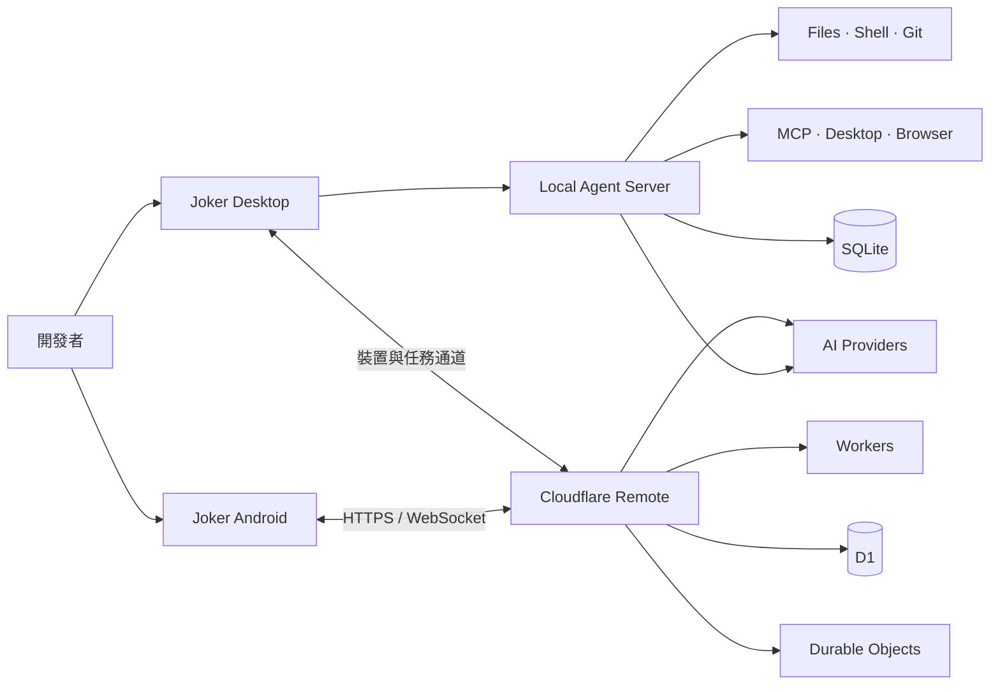

<div align="center">


# ⌁ Joker

### 本地優先、權限可控的 AI Coding Agent

讓 AI 在明確的工作區邊界與審批策略內，完成程式碼理解、檔案編輯、測試構建、Git 工作流程、桌面操作和跨裝置協作。

<p align="center">
  <a href="README.md"><b>English</b></a> •
  <a href="README.zh-CN.md"><b>简体中文</b></a> •
  <a href="README.zh-TW.md"><b>繁體中文</b></a> •
  <a href="README.ja.md"><b>日本語</b></a>
</p>

[](#-執行端)
[](#-執行端)
[](#-快速開始)
[](#-技術棧)

`本地執行` · `逐級審批` · `多模型接入` · `圖片生成` · `手機遠端` · `MCP 擴充`

</div>

---

## ✦ 專案簡介

Joker 是一個面向真實開發工作的本地 AI Agent 框架。它透過桌面客戶端連接 OpenAI-compatible 模型，在專案工作區內呼叫檔案、終端機、Git、瀏覽器與桌面自動化工具，並以 `allow / ask / deny` 權限規則控制操作範圍。

專案同時包含 Android 客戶端與 Cloudflare 遠端服務：電腦在線時，可從手機進入公開的專案和對話繼續執行 Agent 任務；電腦離線時，Work 模式仍可透過雲端代理聊天或生成圖片。

> [!IMPORTANT]
> Joker 依賴路徑校驗、指令分析、工具審批和審計記錄提供便攜式安全邊界，但不宣稱具備 OS 級沙箱。涉及生產環境、敏感資料或高權限指令時，仍應使用容器、專用帳號或隔離主機。

## ◈ 核心能力

| 模組 | 能力說明 |
| --- | --- |
| 🤖 **Agent 工作流程** | SSE 即時呈現準備、規劃、檢查、執行、審批與完成階段；支援僅規劃後確認執行 |
| 🧰 **本地工具** | 檔案讀寫、文字搜尋、Patch、測試構建、長期行程、網頁讀取、Git 與專案診斷 |
| 🛡️ **權限系統** | `allow / ask / deny` 規則、工作區邊界、強制審批、敏感路徑保護與審計記錄 |
| 🧠 **上下文管理** | 載入 `AGENTS.md`、專案規則、Skills 與記憶；長對話自動壓縮並保持工具呼叫鏈完整 |
| 🔌 **模型與 MCP** | 多 OpenAI-compatible 介面、模型探索、思考強度切換及 MCP 工具動態接入 |
| 🎨 **圖片生成** | 桌面端與手機端圖片模式；支援圖片模型選擇、生成預覽和本地檔案儲存 |
| 🖥️ **桌面控制** | 透過 `native-devtools-mcp` 使用 Accessibility、螢幕截圖/OCR 和 Chrome/Electron CDP |
| 📱 **跨裝置協作** | Android 聊天、裝置探索、專案/對話選擇、遠端任務、即時事件和單次審批 |
| ☁️ **遠端服務** | Cloudflare Workers + D1 + Durable Objects 提供帳號、加密 AI 設定與 WebSocket 中繼 |
| ♻️ **自動學習** | 從已驗證結果中沉澱可重複使用的經驗，並透過去重記錄注入後續專案上下文 |

## ⌘ 系統結構



## ▣ 執行端

| 執行端 | 主要目錄 | 開發 | 構建 / 驗證 |
| --- | --- | --- | --- |
| **電腦客戶端** | `src/`、`electron/`、`cli/` | `npm run desktop:dev` | `npm run desktop:build` |
| **本地 Agent 服務** | `server/` | `npm run server:dev` | `npm run server:test` |
| **Android 客戶端** | `Joker_apk/` | `npm run mobile:dev` | `npm run mobile:build` / `npm run mobile:apk` |
| **雲端帳號與遠端服務** | `Fwq/` | `npm run remote:dev` | `npm run remote:check` / `npm run remote:test` |

## ▶ 快速開始

### 環境需求

- Node.js 20+
- npm
- macOS 桌面客戶端開發環境
- Android Studio（僅構建 Android APK 時需要）

### 啟動桌面開發環境

```bash
npm install
cp .env.example .env
npm run desktop:dev
```

Vite 預設位址通常為 `http://localhost:5173`。

### 設定 AI 介面

後端相容 Chat Completions 與 Images 風格的 OpenAI-compatible API：

```env
AI_API_KEY=your_api_key
AI_BASE_URL=https://api.openai.com/v1
AI_MODEL=gpt-4.1-mini
```

也可以在應用設定中維護多個介面、探索模型、選擇預設文字/圖片模型，並設定不同思考強度。API Key 應只儲存在本機環境或應用安全設定中，切勿提交至版本庫。

### 常用驗證指令

```bash
npm test                 # 本地 Agent 服務測試
npm run build            # 桌面 Web 構建
npm run mobile:build     # Android Web 資源構建
npm run remote:test      # Cloudflare 遠端服務測試
```

## 🧠 雙層記憶

設定 → 記憶中可以分別設定兩層上下文：

- **短時記憶**：依 token 預算保留最近完整對話輪次，將較早內容壓縮為本地摘要，並限制超長工具輸出。
- **長期記憶**：以專案路徑隔離儲存至本機 SQLite，依關鍵字關聯度、重要度和時效召回；支援過期時間、去重和敏感憑證攔截。

內建 `memory-management` Skill 提供統一適配約定。其他開源 Memory Skill 也可將持久化操作委託給 `memory_search`、`memory_store` 和 `memory_forget`，無需直接依賴 Joker 的資料庫結構。關閉「Skill 適配」後，這三個工具不會暴露給模型。

## ⚙ 長期行程工作階段

開發伺服器、檔案監聽器等不會自行結束的指令由 Joker 代管，無需添加 `&` 或 `nohup`：

- `start_process`：啟動長期行程並回傳工作階段 ID、PID 和啟動輸出。
- `read_process`：讀取目前狀態和最近輸出。
- `write_process`：向行程標準輸入傳送內容。
- `stop_process`：停止行程及其子行程樹。
- `list_processes`：列出目前專案的代管行程。

聊天輸入框的「終端機」入口可檢視狀態、PID、指令與輸出。Joker 服務結束時會清理仍在執行的代管行程，不會在重啟後自動恢復舊指令。

## ◉ macOS 桌面控制

Joker 可連接本地 `native-devtools-mcp`，讀取和操作 macOS 應用程式介面：

```bash
npm install -g native-devtools-mcp@0.10.1
native-devtools-mcp setup
```

在 MCP 設定中使用執行檔的絕對路徑新增 stdio 服務，並在「系統設定 → 隱私權與安全性」中依需求授權：

- **螢幕錄製**：截圖與 OCR。
- **輔助使用**：點擊、輸入、捲動、拖曳和 Accessibility 元件操作。

建議保持修改介面的操作為 `ask`。Agent 會優先採用不移動滑鼠的 Accessibility 操作，並在介面發生變化後重新觀察。

## 🔐 權限與安全

Joker 採用「工作區邊界 + 工具審批 + 審計記錄」的分層策略：

- 專案內讀取、編輯、搜尋、測試和構建可依策略自動執行。
- 安裝依賴、聯網、遷移與容器修改會在執行前提示。
- Git 提交/推送、部署和雲端資源修改必須確認。
- 資料刪除、生產操作及提權指令逐次確認。
- `.env*`、SSH 私鑰、鑰匙圈和瀏覽器登入資料庫等敏感目標預設禁止。
- 金鑰透過允許清單引用注入，不進入工具參數，輸出中的實際值會被脫敏。

完整規則與安全邊界請參閱 [能力與權限基準](docs/capabilities-and-permissions.md)。

## ☁ 帳號與遠端協作

`Fwq/` 提供 Cloudflare Workers 遠端服務：

- 註冊、登入、對話恢復與登出。
- D1 儲存帳號、工作階段、裝置、任務和加密後的 AI 介面設定。
- Durable Objects 協調同一帳號下的即時裝置連線。
- 一次性 WebSocket ticket 和帳號級房間隔離。
- Work 模式在電腦離線時代理聊天與圖片生成。
- Code 模式僅存取電腦主動公開的專案 ID，不接受手機端傳入任意主機路徑。

詳細 API、部署方式與安全設計見 [`Fwq/README.md`](Fwq/README.md)；Android 能力與構建說明見 [`Joker_apk/README.md`](Joker_apk/README.md)。

## ⧉ 技術棧

- **桌面與 Web：** Electron、React 19、Vite、TypeScript
- **本地服務：** Node.js、Express、SQLite
- **行動端：** React、Capacitor、Android
- **雲端：** Cloudflare Workers、D1、Durable Objects
- **協議與擴充：** SSE、WebSocket、MCP、OpenAI-compatible APIs

## ◇ 專案目錄

```text
Joker/
├── src/                 # 桌面端 React 介面
├── electron/            # Electron 主行程與安全儲存
├── server/              # 本地 Agent、工具、權限與狀態服務
├── cli/                 # 命令列進入點
├── config/              # Agent 與模型供應商設定
├── docs/                # 能力、權限與設計文件
├── Joker_apk/           # Android 客戶端
└── Fwq/                 # Cloudflare 帳號與遠端服務
```

---

<div align="center">

**Joker · Code locally, approve explicitly, collaborate anywhere.**

</div>
