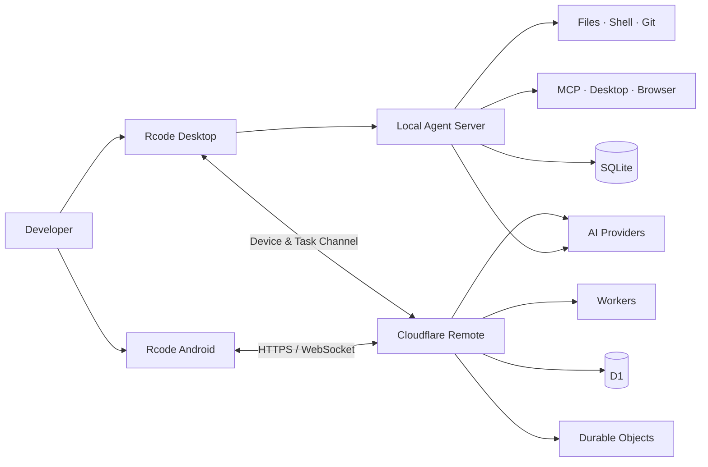

<div align="center">

# ⌁ Rcode

### A local-first, permission-controlled AI coding agent

Enable AI to work within explicit workspace boundaries and approval policies to perform code understanding, file editing, test/build, Git workflows, desktop automation, and cross-device collaboration.

[](#-runtimes)
[](#-runtimes)
[](#-quick-start)
[](#-tech-stack)

`Local-first` · `Approval-based` · `Multi-model support` · `Image generation` · `Mobile remote` · `MCP extensibility`

</div>

---

## ✦ Project Overview

Rcode is a local AI agent framework for real development workflows. It connects the desktop client to OpenAI-compatible models and operates within the project workspace to access files, terminal, Git, browser, and desktop automation tools, while enforcing `allow / ask / deny` rules for actions.

The project also includes an Android client and Cloudflare remote service: when the computer is online, the phone can access shared projects and sessions to continue agent tasks; when the computer is offline, Work mode can still use the cloud proxy for chat or image generation.

> [!IMPORTANT]
> Rcode relies on path validation, command analysis, tool approval, and audit logging to provide a portable security boundary, but it does not claim OS-level sandboxing. For production, sensitive data, or high-privilege commands, use containers, dedicated accounts, or isolated hosts.

## ◈ Core Capabilities

| Module | Capability |
| --- | --- |
| 🤖 Agent Workflow | SSE presents preparation, planning, checking, execution, approval, and completion stages in real time; supports planning-only mode before execution |
| 🧰 Local Tools | File read/write, text search, patching, test/build, long-running processes, webpage reading, Git, and project diagnostics |
| 🛡️ Permission System | `allow / ask / deny` rules, workspace boundaries, enforced approvals, sensitive path protection, and audit logs |
| 🧠 Context Management | Load `AGENTS.md`, project rules, Skills, and memories; long sessions auto-compact while preserving tool call chains |
| 🔌 Models & MCP | Multiple OpenAI-compatible interfaces, model discovery, reasoning intensity switching, and dynamic MCP tool integration |
| 🎨 Image Generation | Desktop and mobile image modes; supports model selection, preview, and local file saving |
| 🖥️ Desktop Control | Use `native-devtools-mcp` for Accessibility, screenshots/OCR, and Chrome/Electron CDP |
| 📱 Cross-device Collaboration | Android chat, device discovery, project/session selection, remote task execution, real-time events, and one-time approvals |
| ☁️ Remote Service | Cloudflare Workers + D1 + Durable Objects for account, encrypted AI config, and WebSocket relay |
| ♻️ Auto-learning | Capture reusable experience from verified results and inject de-duplicated records into later project context |

## ⌘ System Architecture



## ▣ Runtimes

| Runtime | Main directories | Dev | Build / Validation |
| --- | --- | --- | --- |
| Desktop client | `src/`, `electron/`, `cli/` | `npm run desktop:dev` | `npm run desktop:build` |
| Local agent service | `server/` | `npm run server:dev` | `npm run server:test` |
| Android client | `Rcode_apk/` | `npm run mobile:dev` | `npm run mobile:build` / `npm run mobile:apk` |
| Remote account and service | `Fwq/` | `npm run remote:dev` | `npm run remote:check` / `npm run remote:test` |

## ▶ Quick Start

### Requirements

- Node.js 20+
- npm
- macOS desktop client development environment
- Android Studio (only required for building the Android APK)

### Start desktop development

```bash
npm install
cp .env.example .env
npm run desktop:dev
```

Vite default URL is typically `http://localhost:5173`.

### Configure AI interface

The backend supports OpenAI-compatible Chat Completions and Images APIs:

```env
AI_API_KEY=your_api_key
AI_BASE_URL=https://api.openai.com/v1
AI_MODEL=gpt-4.1-mini
```

You can also manage multiple endpoints in app settings, discover models, choose default text/image models, and configure different reasoning intensities. API keys should remain local or in secure app storage and should not be committed to version control.

### Common validation commands

```bash
npm test                 # local agent service tests
npm run build            # desktop web build
npm run mobile:build     # Android web asset build
npm run remote:test      # Cloudflare remote service tests
```

## 🧠 Two-layer memory

In Settings → Memory, you can configure two context layers separately:

- **Short-term memory:** keep recent conversation turns intact within token budget, compress older content into local summaries, and limit overly long tool output.
- **Long-term memory:** store project-isolated records in local SQLite, recall by keyword relevance, importance, and recency; supports expiration, deduplication, and sensitive credential filtering.

The built-in `memory-management` Skill provides a unified adapter contract. Other open-source memory Skills can delegate persistence to `memory_search`, `memory_store`, and `memory_forget` without depending directly on Rcode's database schema. When Skill adapter support is disabled, these three tools are not exposed to models.

## ⚙ Long-running process sessions

Commands that do not exit on their own, such as dev servers or file watchers, are managed by Rcode without requiring `&` or `nohup`:

- `start_process`: start a long-running process and return a session ID, PID, and startup output.
- `read_process`: read current status and recent output.
- `write_process`: send input to the process stdin.
- `stop_process`: stop the process and its child process tree.
- `list_processes`: list managed processes for the current project.

The chat input’s terminal panel can show status, PID, command, and output. When the Rcode service exits, it cleans up still-running managed processes and does not automatically restore old commands after restart.

## ◉ macOS desktop control

Rcode can connect to a local `native-devtools-mcp` service to inspect and operate macOS app interfaces:

```bash
npm install -g native-devtools-mcp@0.10.1
native-devtools-mcp setup
```

In MCP configuration, add the stdio service with the executable’s absolute path, and grant permissions in System Settings → Privacy & Security as needed:

- **Screen Recording:** screenshots and OCR.
- **Accessibility:** click, input, scroll, drag, and operate Accessibility elements.

It is recommended to keep UI-modifying actions as `ask`. The agent prefers Accessibility operations that do not move the mouse and re-observes after interface changes.

## 🔐 Permissions & security

Rcode adopts a layered strategy of workspace boundaries, tool approval, and audit logging:

- Workspace file read, edit, search, test, and build can be executed automatically according to policy.
- Dependency installation, network access, migrations, and container changes are shown before execution.
- Git commit/push, deployment, and cloud resource changes require confirmation.
- Data deletion, production operations, and privilege escalation commands require step-by-step confirmation.
- `.env*`, SSH private keys, keychain files, and browser login databases are blocked by default.
- Secrets are injected by allowlist reference and do not enter tool parameters; actual values are redacted in output.

See [Capabilities and Permissions Baseline](docs/capabilities-and-permissions.md) for full rules and security boundaries.

## ☁ Account & remote collaboration

`Fwq/` provides Cloudflare Workers remote service:

- register, login, restore session, and logout.
- D1 stores accounts, sessions, devices, tasks, and encrypted AI configuration.
- Durable Objects coordinate real-time device connections for the same account.
- One-time WebSocket tickets and account-level room isolation.
- Work mode proxies chat and image generation when the computer is offline.
- Code mode only accesses project IDs explicitly shared by the computer and does not accept arbitrary local paths from the phone.

See [`Fwq/README.md`](Fwq/README.md) for API, deployment, and security design details; see [`Rcode_apk/README.md`](Rcode_apk/README.md) for Android capabilities and build instructions.

## ⧉ Tech stack

- **Desktop & Web:** Electron, React 19, Vite, TypeScript
- **Local service:** Node.js, Express, SQLite
- **Mobile:** React, Capacitor, Android
- **Cloud:** Cloudflare Workers, D1, Durable Objects
- **Protocols & extensions:** SSE, WebSocket, MCP, OpenAI-compatible APIs

## ◇ Project layout

```text
Rcode/
├── src/                 # desktop React UI
├── electron/            # Electron main process and secure storage
├── server/              # local agent, tools, permissions, and state service
├── cli/                 # command-line entrypoints
├── config/              # agent and model provider configuration
├── docs/                # capabilities, permissions, and design docs
├── Rcode_apk/           # Android client
└── Fwq/                 # Cloudflare account and remote service
```

---

<div align="center">

**Rcode · Code locally, approve explicitly, collaborate anywhere.**

</div>
